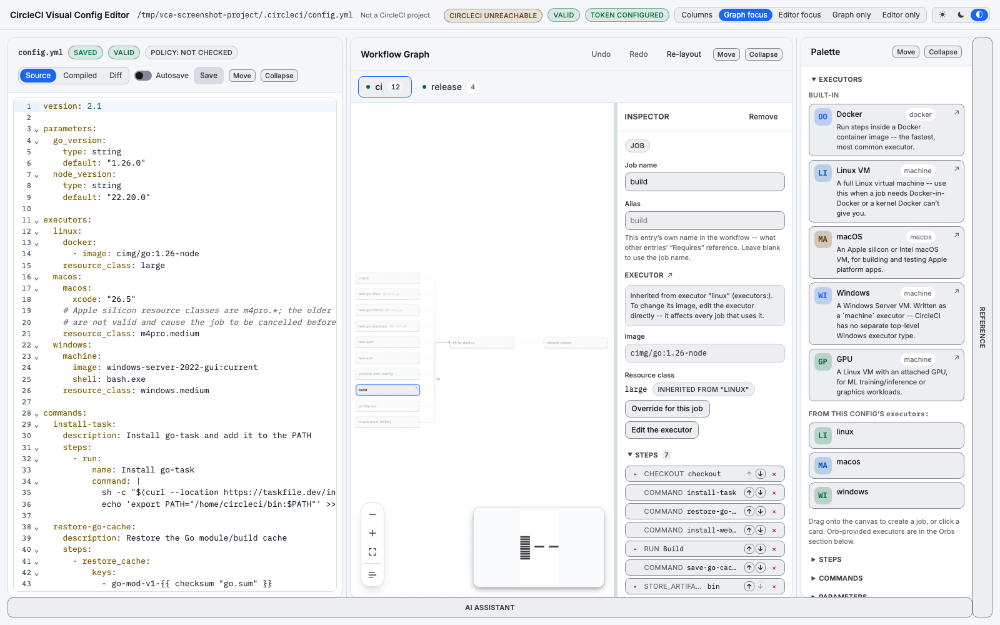
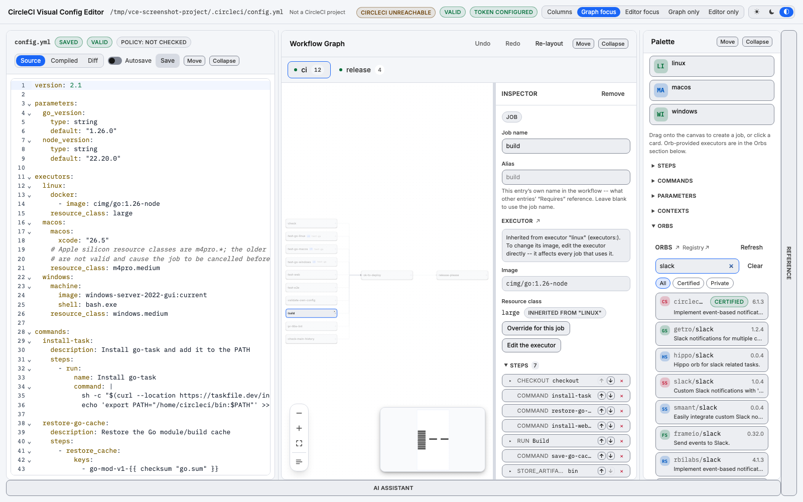

# CircleCI Editor

A visual, drag-and-drop editor for your `.circleci/config.yml`.

[Contributing](./CONTRIBUTING.md) | [Code of Conduct](./CODE_OF_CONDUCT.md)

[](https://pkg.go.dev/github.com/CircleCI-Labs/circleci-editor)
[](./LICENSE)

## Disclaimer

CircleCI Labs is a collection of solutions developed by members of CircleCI's
Field Engineering team through our engagement with various customer needs. This
repository is part of that collection.

✅ Created by engineers @ CircleCI

✅ Used by real CircleCI customers

❌ not officially supported by CircleCI support

## What it is

`circleci-editor` is a small Go binary that boots a local web server,
opens your browser, and serves a single-page app for editing your CircleCI
configuration. Five panes, each independently movable and collapsible:

* **Config** — a full-featured YAML editor, with a toggle between what you
  wrote and the fully-expanded config CircleCI actually runs (orbs
  resolved, defaults applied).
* **Workflow Graph** — a drag-and-drop, visual view of your jobs and
  workflows, kept in sync with the YAML.
* **Palette** — draggable executors, steps, commands, parameters and
  contexts, plus a live orb registry search.
* **Reference** — the CircleCI config schema and documentation without
  leaving the tool, alongside this project's own settings, config policies
  and caches.
* **AI Assistant** — an optional, bring-your-own-key chat about the open
  config that can propose edits, always as a diff you approve before
  anything is written.

## What leaves your machine

The editor is a local tool. The host binds `127.0.0.1` only, your config is read
from and written to your own working copy, and nothing is deployed. There is no
telemetry and no analytics: this project never receives anything about your
config, your repository, or your usage.

It does make outbound requests, each for a feature you invoke:

| Host | For | Credential |
|---|---|---|
| `circleci.com`, `app.circleci.com` | Validating and compiling your config, checking config policies, project and context lookups, the machine-image catalogue, the orb registry, and the usage data behind right-sizing suggestions | Your `CIRCLE_TOKEN` — except orb search and the image catalogue, which need none |
| `hub.docker.com` | Listing available tags for a Docker image | None |
| `api.github.com` | Checking whether the bundled CircleCI documentation snapshot is out of date | None |
| `api.anthropic.com` | The AI pane, and only when you press Send | The AI key you configured |
| `circleci.mcp.kapa.ai` | CircleCI's documentation MCP server, if you enable it in the AI pane | Its own token, if required |

Validation deliberately sends your config to CircleCI's own compiler rather than
approximating it locally — that is what makes the result authoritative rather
than a second opinion.

**The AI pane is the one place your file contents go to a third party.** It is
off until you configure a key, it sends nothing until you press Send, and what
it sends is the open config's text and path, the other files in `.circleci/`,
your job and workflow names, and the current validation result. Nothing else in
the repository is read for it. CircleCI is not in that path and neither are we.
The Reference pane in the app carries the disclosure in full, under *What the AI
pane sends, and to whom*.

## Screenshots

The Config, Workflow Graph, and Palette panes together, with a job
selected in the graph and its details open in the inspector:



Searching the orb registry from the Palette pane:



## Installation

Running a released binary requires nothing beyond the binary itself; building
from source requires Go 1.26, Node 22, [pnpm](https://pnpm.io/), and
[go-task](https://taskfile.dev/) — see [Development](#development) below.

The binary must end up on your `PATH` **named `circleci-editor`**. The
CircleCI CLI's plugin mechanism treats any executable named
`circleci-<name>` on `PATH` as `circleci <name>`, so that name (not any
registration step) is what makes `circleci editor` work. See
[docs/INSTALL.md](./docs/INSTALL.md) for the long-form version of everything
below, including verification and uninstall steps.

**curl-pipe installer** (macOS and Linux):

```shell
curl -fsSL https://raw.githubusercontent.com/CircleCI-Labs/circleci-editor/main/scripts/install.sh | sh
```

Detects your OS/arch, downloads the matching release archive, verifies its
SHA-256 checksum against the release's `checksums.txt`, and installs the
binary to `/usr/local/bin` (falling back to `~/.local/bin`). It's POSIX
`sh`, so it also works under `dash` and other minimal shells. It doesn't
support Windows; use one of the options below there instead.

**`go install`** (any platform with Go 1.26+):

```shell
go install github.com/CircleCI-Labs/circleci-editor/cmd/circleci-editor@latest
```

**Not recommended:** this doesn't embed the web interface, and the binary
it produces refuses to start rather than pretend otherwise — see
[Development](#development) for why, and how to build a fully working
binary yourself.

**Download a release archive directly** from the
[Releases page](https://github.com/CircleCI-Labs/circleci-editor/releases):
pick the archive matching your OS/arch, extract it, and put
`circleci-editor` on your `PATH`. Each release also publishes a
`checksums.txt` if you want to verify the download.

Once it's on your `PATH`, the CircleCI CLI picks it up automatically as a
plugin, and you can invoke it as `circleci editor` instead of
`circleci-editor`.

## Quick start

From the root of a repository that already has a `.circleci/config.yml`:

```shell
cd my-project
circleci-editor
```

You'll see a startup banner like this, then your default browser opens to
the printed URL:

```
circleci-editor 0.12.0
  URL:         http://127.0.0.1:54321
  Config file: /Users/you/my-project/.circleci/config.yml
```

The Config pane loads your existing file, the Workflow Graph renders its
jobs and workflows, and the Palette is ready to drag from. Edit either the
YAML or the graph — both stay in sync — and click **Save** (or turn on
autosave) when you're ready to write your changes back to
`.circleci/config.yml`. Saving shows a diff first.

If the current directory (or any parent, up to the repository root) has no
`.circleci/config.yml` yet, the banner says so and the editor still starts;
saving creates the file.

If `.circleci/` has more than one YAML file — a `setup: true` config plus
the continuation config it hands off to, for example — a file switcher
appears in the top bar so you can open and edit any of them; the graph and
validation follow whichever file is currently open.

## Usage

```shell
circleci-editor [flags]
circleci-editor start [flags]
circleci-editor ai status [provider]
circleci-editor ai set-key <provider>
circleci-editor ai remove-key <provider>
```

The bare command and `start` are equivalent; `start` is the explicit,
primary-verb form (matching the CircleCI CLI's own `circleci mcp server
start`), and the bare form is kept working because it's what earlier
releases documented.

When installed on `PATH`, the CircleCI CLI also runs it as
`circleci editor` / `circleci editor start`, with the same flags.

`ai` manages the AI pane's provider API key from the terminal — see
[Managing the AI provider key](#managing-the-ai-provider-key) below.

### Flags

| Flag             | Shorthand | Description                                                        |
| ---------------- | --------- | -------------------------------------------------------------------- |
| `--port`         | `-p`      | Port to listen on. `0` (the default) picks a free port automatically. |
| `--config`       | `-c`      | Path to the config file to edit. Default: discovered by walking up from the current directory for `.circleci/config.yml` or `config.yaml`. |
| `--no-browser`   |           | Don't automatically open a browser window. Also means the editor never stops on its own, since nothing may ever connect to it. |
| `--app`          |           | Open in a chromeless, app-style browser window instead of a normal tab. |
| `--keep-alive`   |           | Keep running after you close the editor window. Without it, the editor stops about 6s after the last window closes. Implied by `--no-browser`. |
| `--debug`        |           | Print progress and cache diagnostics. Also settable as `CIRCLECI_EDITOR_DEBUG`. |
| `--version`      | `-v`      | Print the version, commit, and build date.                          |
| `--help`         | `-h`      | Print usage.                                                        |

Closing the editor window stops the editor. Unsaved changes are confirmed
first via the browser's own "Leave site?" prompt. `Ctrl-C` works exactly as
you'd expect.

### Environment variables

| Variable          | Description                                                                                    |
| ------------------ | ------------------------------------------------------------------------------------------------ |
| `CIRCLE_TOKEN`     | CircleCI API token. Required for config validation, and to see your organizations' *private* orbs. Not required to search or browse the public orb registry. The CircleCI CLI injects this automatically when the editor runs as a plugin (`circleci editor`); when run standalone, export it yourself. |
| `CIRCLE_HOST`      | CircleCI API host. Defaults to `https://circleci.com`; set this to point at a self-hosted CircleCI server installation. |
| `XDG_CACHE_HOME`   | Overrides where the orb registry cache is stored. Defaults to `~/.cache` on every platform, including macOS. |
| `XDG_CONFIG_HOME`  | Overrides where the AI provider key file lives when the file fallback is in use (see below). Defaults to `~/.config` on every platform, including macOS. |
| `CIRCLECI_EDITOR_AI_KEY_<PROVIDER>` | Supplies an AI provider key without storing one, e.g. `CIRCLECI_EDITOR_AI_KEY_ANTHROPIC`. Takes precedence over any stored key. Nothing is written to disk. |
| `CIRCLECI_EDITOR_AI_KEYSTORE_BACKEND` | `keychain` or `file`. Overrides automatic backend detection for the stored key. |
| `CIRCLECI_EDITOR_DEBUG`        | Set to any value to enable debug logging, exactly like `--debug`. |

> **Renamed in 1.2.0.** These three were previously prefixed `VCE_`
> (`VCE_AI_KEY_<PROVIDER>`, `VCE_AI_KEYSTORE_BACKEND`, `VCE_DEBUG`) — an
> initialism for "visual config editor", a name this project no longer uses.
> The old spellings still work and will keep working for now; using one prints a
> deprecation warning naming its replacement. They will be removed in a future
> major version.

`CIRCLE_PROJECT_ID`, `CIRCLE_VCS_TYPE`, `CIRCLE_PROJECT_USERNAME`,
`CIRCLE_PROJECT_REPONAME`, `CIRCLE_BRANCH`, and `CIRCLE_DEFAULT_BRANCH` are
also read when present (as the CircleCI CLI plugin environment sets them) to
show your project slug in the UI. None of them are required.

### Without a token

Editing, the graph view, and saving all work with no `CIRCLE_TOKEN` set. So
does searching and browsing the public orb registry. Without a token, the
validity badge reports "unavailable" instead of valid/invalid, and the
Palette's **Private** orb filter reports that this host cannot tell whether
your organizations have any private orbs at all — which is a different
statement from "you have none," and it's careful to say so.

### Managing the AI provider key

The AI pane is bring-your-own-key: this tool ships no key and no default
provider account. The key lives with the Go host, never in page JavaScript.
These commands manage exactly the same stored key the pane's own settings
do:

```shell
circleci-editor ai status                 # every known provider
circleci-editor ai status anthropic       # just one
circleci-editor ai set-key anthropic      # prompts, with echo off
circleci-editor ai remove-key anthropic
```

`set-key` never takes the key as an argument, so it prompts for it with
terminal echo off — or, if stdin is a pipe or a file, reads one line from
there, which is what makes seeding a container scriptable:

```shell
printf '%s' "$MY_KEY" | circleci-editor ai set-key anthropic
```

No command ever prints the key, or any part of it.

The key is stored in your OS keychain where one is available (macOS
Keychain, or the Linux Secret Service via `secret-tool`); otherwise it
falls back to a `0600` file under `$XDG_CONFIG_HOME/circleci-editor/`,
which is also where Windows stores it today. `ai status` always says which
one is in effect, and `CIRCLECI_EDITOR_AI_KEY_<PROVIDER>` in the environment overrides
both without ever touching disk.

### The orb cache

Orb search is backed by a local, periodically-refreshed copy of the CircleCI
orb registry (there is no server-side full-text search over it), stored at
`~/.cache/circleci-editor` (or `$XDG_CACHE_HOME/circleci-editor`). It
refreshes automatically after 24 hours. To force a fresh crawl, delete that
directory:

```shell
rm -rf ~/.cache/circleci-editor
```

## What you can do today

* **See your pipeline as a graph, and edit it by dragging.** Workflows
  render as a dependency DAG — approval jobs, orb-provided jobs, and matrix
  jobs included, with cycles and dangling `requires` reported as problems.
  Add and remove jobs, and wire dependencies by dragging between nodes; a
  connection that would create a cycle is refused while you're still
  dragging, not after.
* **Edit a job in the inspector.** Rename it (references are updated for
  you), change its executor image and resource class, and add, remove, and
  reorder steps.
* **Declare and edit parameters.** Both the config's top-level pipeline
  `parameters:` and a job's own `parameters:`: add one, remove one, set its
  type, give it a default, a description, or a list of allowed values.
  Renaming one rewrites every reference to it, plus every workflow entry
  that supplies it by name, as a single undoable step.
* **Search the orb registry and drag orbs in.** Search by name without
  typing a namespace, then drag an orb's job onto the canvas, a command into
  a job's steps, or an executor onto a job. Required parameters are
  collected in a form so you never end up with an invalid config.
* **Ask the AI assistant about your config, or let it propose a change.**
  Bring your own provider key; every proposed edit shows as a diff you
  approve before anything is written, the same way saving does.
* **Know whether it compiles, and never lose your formatting.** Configs are
  validated against CircleCI's compiler as you type, with errors shown
  inline. Edits are surgical changes to the YAML document rather than a
  regeneration, so comments, key order, and formatting survive — saving
  shows a diff first, and undo/redo covers every change.

## Limitations and known gaps

This project is in early development. The feature set above is implemented,
but the CLI, on-disk formats, and APIs should all be considered unstable and
subject to change without notice. Specifically:

* **The AI assistant needs its own provider key.** There's no default
  account or CircleCI-hosted key; until you configure one, the composer
  explains how rather than accepting a message it can only fail on.
* **Validation needs a token; orb search does not.** See [Usage](#usage).
  Without one, editing, the graph, saving, and browsing the public orb
  registry all still work — only validation, and seeing your organizations'
  private orbs, need one.
* **Orb executor params: required only, up front.** Dragging an orb's
  executor onto a job collects its *required* parameters before inserting
  it. Optional parameters aren't exposed in the inspector today — edit the
  YAML directly for those.
* **Cross-platform coverage is uneven.** The Go test suite runs on Linux,
  macOS, and Windows in CI. The web UI and end-to-end browser tests
  currently run on Linux only in CI, so Windows behavior of the app itself
  is comparatively less exercised.
* **No package manager listing yet.** There's no Homebrew tap or similar
  published.

## Troubleshooting

| Symptom | Cause | Fix |
| --- | --- | --- |
| Startup banner says no config file found | No `.circleci/config.yml` (or `.yaml`) exists in the current directory or any parent up to the repository root | Nothing to fix — the editor still starts; saving creates the file at the path shown in the banner. |
| Startup banner warns about a missing token; validation shows "unavailable" | No `CIRCLE_TOKEN` in the environment | Export `CIRCLE_TOKEN`, or run via `circleci editor` so the CircleCI CLI injects it. |
| `bind: address already in use` | The requested (or auto-picked) port is taken | Pass a different port with `--port`, or omit it to let the editor pick a free one. |
| `Error: no web interface embedded` on startup, nothing opens | The binary was built with `go install` or a bare `go build`, without the web build first | Run `task build` (which builds the web app before the Go binary), or use one of [Installation](#installation)'s other options. |
| Orb search returns few or no results right after startup | The local orb registry cache is still warming | Wait a few seconds and search again — certified orbs are searchable almost immediately, and the full registry crawl fills in in the background. |
| Browser tab still open after Ctrl-C, still lets you type | Ctrl-C stops the local server, but doesn't close browser windows it opened | Within a few seconds the tab shows a blocking "Connection lost" notice; if you had unsaved changes, it offers to download or copy them first. |

## Development

Building from source, running tests, and the release process are covered in
[CONTRIBUTING.md](./CONTRIBUTING.md#development-setup). Quick version:

```shell
git clone https://github.com/CircleCI-Labs/circleci-editor.git
cd circleci-editor
task web:install
task build
task check   # everything CI runs
```

See [docs/ARCHITECTURE.md](./docs/ARCHITECTURE.md) for how the binary, the
embedded SPA, and the CircleCI API fit together, and for the design rule
(surgical YAML CST edits, never a parse-mutate-regenerate round trip) the
project is built around.

## Contributing

Contributions are welcome. Please read [CONTRIBUTING.md](./CONTRIBUTING.md)
for details on reporting bugs, opening issues, and submitting pull requests.
This project is governed by our [Code of Conduct](./CODE_OF_CONDUCT.md).

## License

This project is licensed under the [MIT License](./LICENSE). See
[CONTRIBUTING.md](./CONTRIBUTING.md#third-party-attributions) for
third-party code and content bundled into it.
