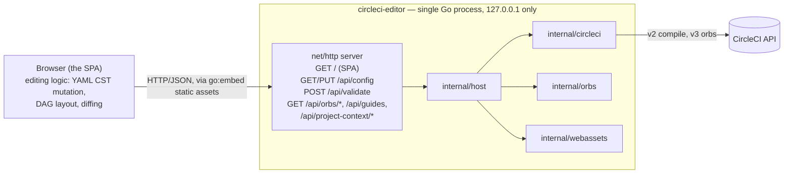

# Architecture

This document describes how `circleci-editor` is put together, and
why it's put together that way. It's aimed at contributors who need to add a
feature or debug a problem, not at end users (see the [README](../README.md)
for that).

## The shape of the thing

`circleci-editor` is a single Go binary. It embeds a built React
single-page application, starts an HTTP server bound to `127.0.0.1`, and
opens the user's default browser to it. There is no separate frontend
process, no Electron/Chromium runtime bundled into the binary, and no
persistent background service — the process exits when the user closes the
terminal (Ctrl-C) or, in due course, when the browser tab is closed.



Everything inside the `circleci-editor` box is Go; the browser side is
TypeScript/React (`web/`), built with Vite and embedded into the binary at
`internal/webassets/dist` via `go:embed` (see
`internal/webassets/embed.go`). The Go side is deliberately dumb: it resolves
and reads/writes a config file on disk, proxies a couple of CircleCI API
calls, and serves static files. It has no opinion about YAML structure,
workflow layout, or diffing — that all lives in the SPA.

### Why a local server + browser, not Electron/Tauri

- **No cross-platform GUI packaging.** A `go build` for six `GOOS`/`GOARCH`
  combinations (see `.goreleaser.yml`) is far simpler to build, sign, and
  distribute than six desktop-shell bundles.
- **The SPA stays portable.** The same `web/` bundle also runs, unmodified,
  against the Vite dev server during development (`task dev`), and would
  work unmodified as a hosted web app.
- **`--app` mode gets most of the desktop feel anyway.** Passing `--app`
  asks the OS's browser to open a chromeless window
  (`internal/host/browser.go`) instead of a normal tab.
- **CircleCI CLI plugins are just binaries.** The distribution mechanism
  this tool needs is "an executable on `PATH`" — exactly what a Go binary
  already is.

The trade-off is real (no dock icon; depends on the user having a browser),
and it was accepted deliberately.

### How this becomes `circleci editor`

The CircleCI CLI has a plugin mechanism: any executable named
`circleci-<name>` found on `PATH` becomes runnable as `circleci <name>`,
and the CLI injects `CIRCLECI_TOKEN`, `CIRCLE_HOST`, and project metadata into
its environment. This project's binary is named `circleci-editor` for
exactly that reason — see `internal/host/env.go`'s `LoadEnvironment`, which
reads those same variable names. There is no CircleCI-specific registration
step; the naming convention on `PATH` is the entire integration.

## Request flow and the API surface

`cmd/circleci-editor/main.go` parses flags with `cobra`, constructs an
`internal/host.Server`, prints a startup banner, and calls `Server.Run`,
which binds a listener, optionally opens the browser, and serves until
`SIGINT`/`SIGTERM` — or until the last editor window closes (an open
`GET /api/heartbeat` stream is how an open browser tab is counted).

`internal/host/server.go`'s `buildMux` wires up two kinds of routes:

- **`/api/*`**, implemented across `internal/host/api.go`, `validate.go`,
  and `orbs.go`:
  - `GET /api/healthz`, `GET /api/meta` — liveness and version/project
    metadata, including `hasToken` (never the token itself).
  - `GET /api/config` / `PUT /api/config` — read/write the raw config file
    text. The SPA owns everything about what to write; the host just writes
    exactly those bytes (`internal/host/configfile.go`).
  - `POST /api/validate` — proxies to CircleCI's config compiler. Degrades
    to `available: false` rather than erroring when no token is configured.
  - `GET /api/orbs/search`, `GET /api/orbs/source` — orb registry search and
    raw orb source lookup, backing the Palette pane's orb browser. Both
    degrade to `available: false` without a token, same as `/api/validate`.
  - `GET /api/guides` — CircleCI's configuration reference and this
    project's own editor documentation, parsed from AsciiDoc into a block
    model the Reference pane renders. Needs no token. See
    [CONTRIBUTING.md](../CONTRIBUTING.md#third-party-attributions) for the
    licensing basis of vendoring that content.
  - `GET /api/project-context`, `GET /api/project-context/variables` —
    read-only project authoring metadata (context names, environment
    variable names, dynamic config/default branch settings), backing the
    Palette's Contexts and Project sections. Strictly read-only. Degrades to
    `available: false` without a token or outside a CircleCI-connected
    project.
  - Everything else under `/api/` 404s as JSON, rather than falling through
    to the SPA's HTML fallback.
- **Everything else** — either a reverse proxy to a running Vite dev server
  (when `CIRCLECI_EDITOR_DEV_PROXY` is set; see `task dev`), or the embedded SPA
  (`internal/host/assets.go`), which serves `index.html` as a fallback for
  client-side routing, and serves the committed `placeholder.html` instead
  if the binary was built without a real web build.

A typical session: browser loads the SPA shell, the SPA calls
`GET /api/meta` and `GET /api/config` to bootstrap
(`web/src/state/appStore.ts` `load()`), the user edits in one of the panes,
edits flow through `mutate()` into an in-memory YAML document, a debounced
`POST /api/validate` call keeps a validity badge current, and
`PUT /api/config` persists on explicit save or (if enabled) autosave.

## The single most important design rule: the CST is the source of truth

Every visual edit in this app — dragging a job in the graph, renaming a key,
anything — mutates the parsed YAML **Concrete Syntax Tree** (via the
[`yaml`](https://www.npmjs.com/package/yaml) package's `Document`) in place,
surgically, rather than converting the document to a plain JS object,
mutating that, and re-serializing it. This is the central design constraint
of the whole frontend, implemented in `web/src/lib/yaml/documentUtils.ts` and
consumed exclusively through `appStore.mutate()`.

**Why this matters this much:** the predecessor project
([`CircleCI-Archived/visual-config-editor`](https://github.com/CircleCI-Archived/visual-config-editor),
now archived) took the more obvious approach — parse YAML into a typed
object model, let the UI mutate that model, regenerate YAML from it on save.
Regenerating YAML from an object model destroys whatever the parser didn't
model: comments, blank-line grouping, key order, anchors/aliases, quoting
style. Users who hand-maintained a commented, carefully organized
`config.yml` would open it in the editor, make one small change, and get
back a config with all of their comments gone.

Surgical CST edits are also *why* the save flow shows a real unified diff
(`web/src/lib/yaml/diff.ts`) instead of just a "you have unsaved changes"
flag: because edits are surgical, the diff between what's on disk and what
you're about to save is normally tiny, so showing the actual diff is both
cheap to render and genuinely useful to read before committing to a save.

If you're adding a new kind of edit, it must go through `documentUtils.ts`
(or an equivalent surgical helper next to it) and `appStore.mutate()`. Never
add a code path that does `doc.toJS()`, mutates the result, and turns it
back into YAML with `YAML.stringify()`.

## CircleCI APIs: what's used, and why the versions differ

- **Config compilation is v2-only.** `POST /api/v2/compile-config-with-defaults`
  (`internal/circleci/compile.go`) is what backs `POST /api/validate`. There
  is no v3 equivalent — it simply hasn't been ported.
- **Orbs are v3-only.** `GET /api/v3/orb/packages` and
  `GET /api/v3/orb/versions/{id}/source` (`internal/circleci/orbs.go`) back
  the orb search/browse feature.
- **Unlike config compilation, the orb endpoints above answer
  unauthenticated** — the public registry is, well, public.
  `internal/orbs.Cache` is warmed and served regardless of whether
  `CIRCLE_TOKEN` is set; a token only changes whether the crawl can see a
  *private* namespace.

There is no server-side full-text search over the orb registry on either
version — `filter[name]` on `/api/v3/orb/packages` is an *exact*
`namespace/name` match, not a search. So `internal/orbs` (`cache.go`,
`search.go`) crawls the registry itself, persists the result to disk
(`~/.cache/circleci-editor` by default, following XDG), and ranks matches
against it locally.

## Why `internal/circleci` is hand-rolled

We do not depend on
[`circleci-sdk-go`](https://github.com/CircleCI-Public/circleci-sdk-go): it
has no config-compile support, and it's maintained primarily for the
Terraform provider. We also can't import `circleci-cli`'s own
`internal/httpcl` package directly — Go's `internal/` import-visibility rule
blocks that from outside `circleci-cli`'s own module tree, regardless of
licensing. `internal/circleci` is therefore a from-scratch implementation,
adapted from `httpcl`'s design (its retry policy, `Circle-Token` header
handling, its `APIError` shape) rather than a copy of its source. See
[CONTRIBUTING.md](../CONTRIBUTING.md#third-party-attributions) for the full
attribution.

## Security posture

- The server binds `127.0.0.1` explicitly, never `0.0.0.0` — this is a
  local developer tool, not a network service.
- `CIRCLE_TOKEN` is read once at startup (`internal/host/env.go`) and never
  serialized anywhere the API can return it. `GET /api/meta` exposes only a
  `hasToken` boolean.
- Config file writes are atomic: `ConfigFile.Write`
  (`internal/host/configfile.go`) writes to a temp file in the same
  directory, `fsync`s it, then `rename`s it over the target path, so a
  crash or concurrent read never observes a half-written config file.

## Directory map

```
cmd/circleci-editor/          main.go: flag parsing, startup banner, signal handling
internal/host/                HTTP server, JSON API handlers, config file I/O,
                               CircleCI CLI environment, browser launching
internal/circleci/            Hand-rolled CircleCI API client (v2 compile, v3 orbs)
internal/orbs/                Orb registry cache + local search/ranking
internal/ai/                  AI provider client, MCP OAuth, key storage
internal/guides/              Vendored + refreshed CircleCI docs for the Reference pane
internal/webassets/           go:embed of the built SPA (+ placeholder.html)
web/src/state/appStore.ts     The zustand store: doc/text, dirty/save state,
                               autosave, debounced validation
web/src/lib/yaml/             documentUtils.ts (surgical CST edits), diff.ts
                               (unified diff for the save flow)
web/src/lib/rpc/client.ts     Typed fetch client for the host's JSON API
web/src/panes/{yaml,ai,dag,docs}/  The panes (see below)
web/src/panes/inspector/      Job inspector, docked alongside the graph
web/src/panes/orbs/           Orb browser (search, drag-to-insert), docked
                               alongside the graph
```

Where to add things:

- A new host API endpoint: add a handler in `internal/host/*.go`, register
  it in `buildMux`, add a typed client function in `web/src/lib/rpc/client.ts`.
- A new kind of visual edit: add a surgical helper to
  `web/src/lib/yaml/documentUtils.ts`, call it only through
  `appStore.mutate()`.
- A new CircleCI API call: add it to `internal/circleci/`, following the
  existing pattern of a wire (JSON) type plus a translated public type — and
  check which API version (v2 vs v3) actually has the endpoint you need
  before assuming it exists on both.

## How the panes relate

`web/src/App.tsx` lays out five independently movable/collapsible panes, all
reading from and writing to the *same* `appStore` document:

- **Config** (`panes/yaml/`) — a direct text editor over `text`/`doc`.
  Typing here calls `setText`, which reparses and updates `doc` (or, on a
  parse error, leaves `doc` pointing at the last good parse so the other
  panes don't blank out mid-edit).
- **Workflow Graph** (`panes/dag/`) — a visual, drag-and-drop view of jobs
  and workflows, read from `getWorkflowJobEntries`/`getWorkflowNames` and
  written back through the same surgical `mutate()` path as everything
  else. The **job inspector** (`panes/inspector/`) and **orb browser**
  (`panes/orbs/`) dock alongside it rather than counting as panes of their
  own.
- **Palette** (`panes/dag/palette/`) — draggable executors, steps,
  commands, parameters, contexts, and project settings.
- **Reference** (`panes/docs/`) — the config JSON Schema (`Keys`) and the
  vendored/editor-authored guides (`Guides`), served from
  `GET /api/guides` and `GET /api/schema`.
- **AI Assistant** (`panes/ai/`) — a bring-your-own-key chat about the open
  config that can propose a change, always as a diff the user approves
  before anything is written (`ProposeChangeDialog`). The composer is
  disabled — with an explanation, not a silent no-op — until a provider key
  is configured; everything else is unaffected by whether one is.

None of the panes owns the data; `doc` in `appStore` does. That's what lets
a YAML edit show up instantly in the graph and vice versa, and it's the same
invariant, at the state-management layer, that `documentUtils.ts` enforces
at the AST layer: one document, edited in place, never regenerated from
scratch.

`appStore.switchFile` generalizes "one document" to "one *active* document":
it can point `doc` at a different file (e.g. when `.circleci/` has more than
one YAML file), snapshotting whichever one it left into `docCache` and
restoring it byte-for-byte on return. Every pane above still reads only the
top-level `doc`/`text`/... fields, unaware that a cache of other files
exists at all.
